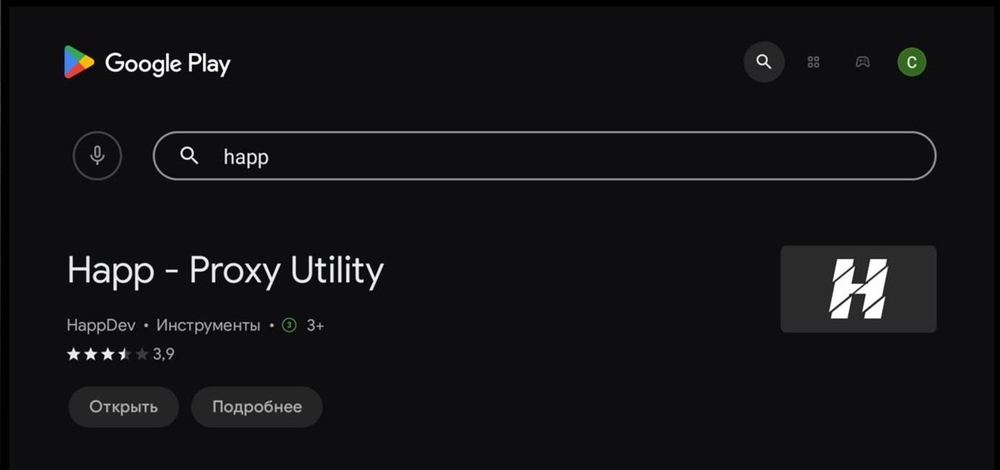
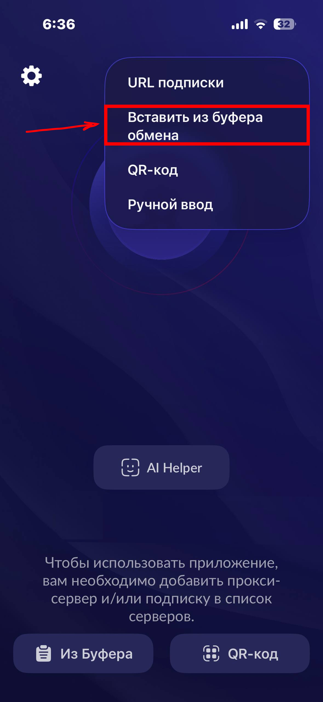
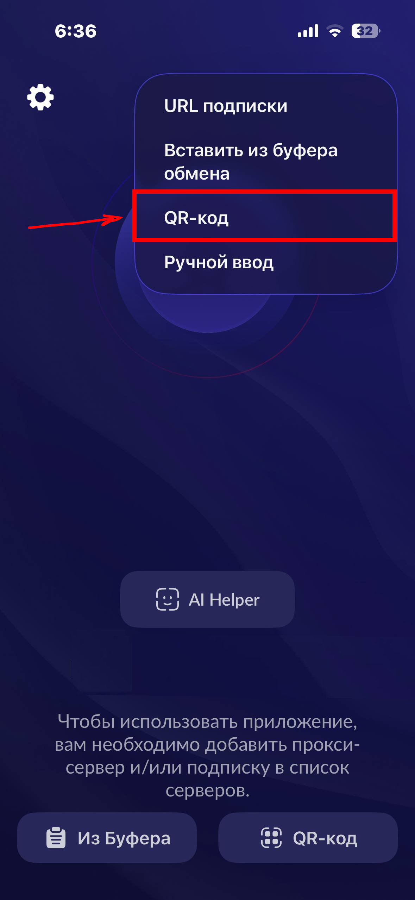
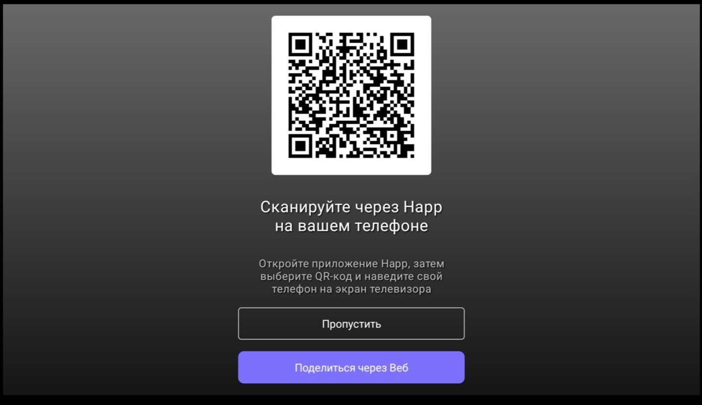
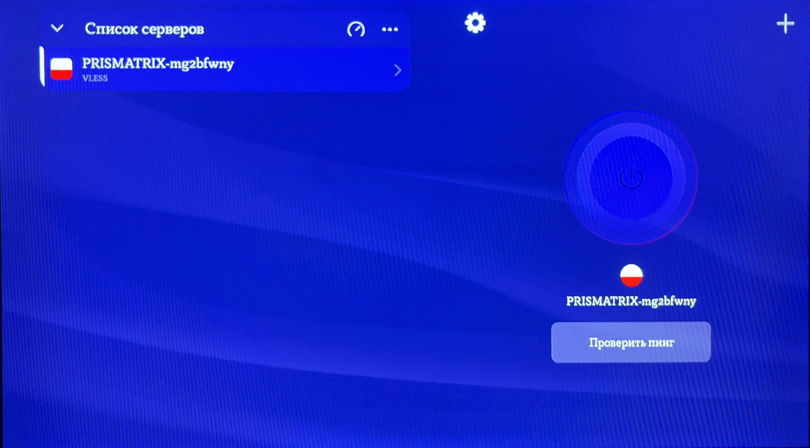
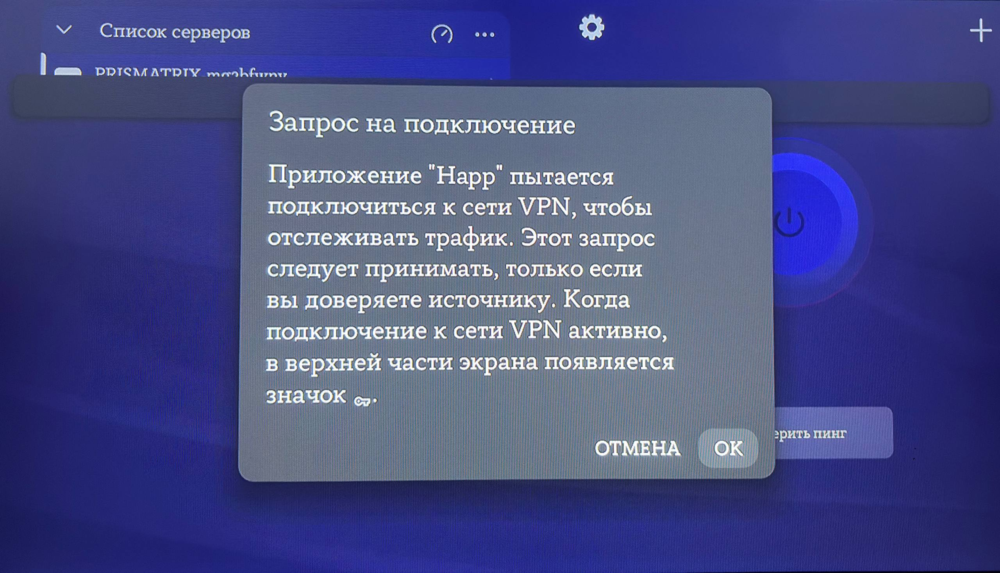

# Инструкция по установке и подключению Happ VPN

Подробное руководство по установке приложения Happ на телефон и телевизор с последующим подключением VPN.

---

## 1. Установка приложения на телефон

1. Откройте **Play Market** (Android) или **App Store** (iOS).  
2. Найдите приложение **Happ**.  
3. Установите приложение на телефон и дождитесь окончания установки.

---

## 2. Установка приложения на ТВ-приставку

1. Откройте магазин приложений на вашей ТВ-приставке.  
2. Найдите приложение **Happ**   
3. Скачайте и установите его на приставку.

---

## 3. Подготовка ключа в Telegram-боте

1. Откройте наш **Telegram-бот** на телефоне.  
2. Перейдите в раздел **«Мои ключи»**
3. Скопируйте ваш персональный ключ (он будет сохранён в буфере обмена).

   

---

## 4. Добавление ключа в приложении Happ на телефоне

1. Откройте приложение **Happ** на телефоне.  
2. Нажмите на значок **«+»** в правом верхнем углу.  
3. Выберите пункт **«Вставить из буфера обмена»** — ключ будет добавлен автоматически   
4. Снова нажмите на значок **«+»**.  
5. Выберите пункт **«QR-код»** — на экране появится QR-код   
6. Откройте приложение **Happ** на телевизоре   
7. Наведите камеру (или используйте встроенный сканер) на QR-код, отображаемый на телефоне.  

---

## 5. Подключение VPN на телевизоре

1. После успешного подключения ключа на телевизоре появится интерфейс **VPN**   
2. С помощью стрелок на пульте выберите большую кнопку **«Подключиться»**.  
3. Нажмите **OK** на пульте.  
4. В появившемся системном запросе подтвердите подключение, снова нажав **OK**   

---

## 6. Завершение

**VPN успешно подключён и работает на телевизоре.**  
Дополнительные действия не требуются.
