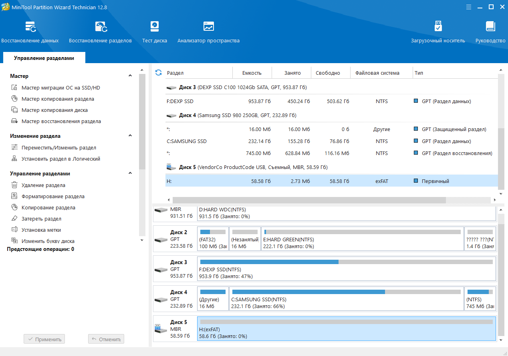
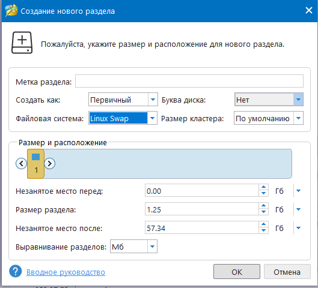
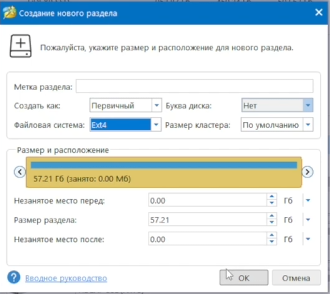
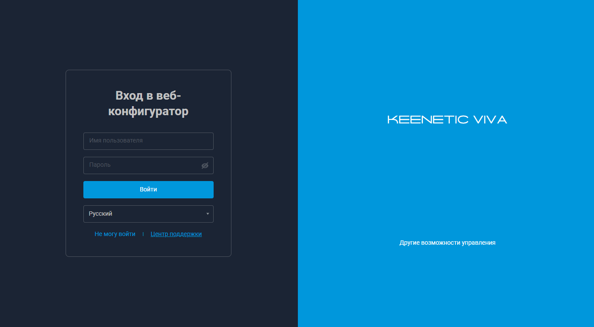
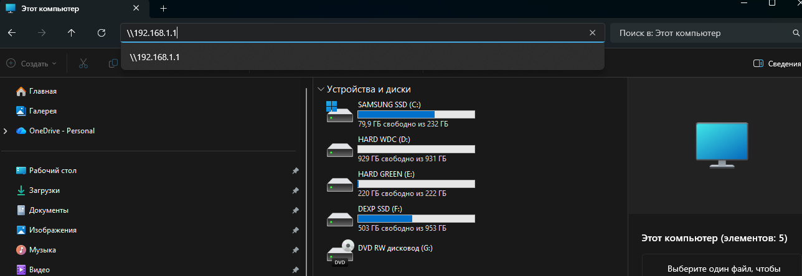
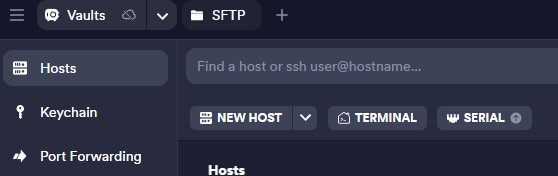
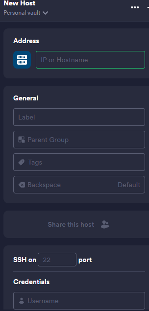
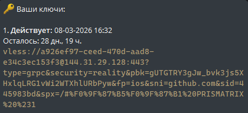
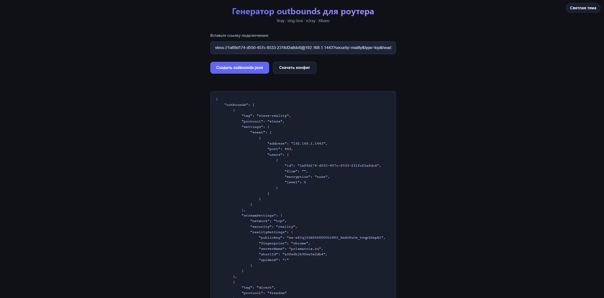

# Установка Prismatrix VPN на Keenetic


> [!NOTE]
> Эта инструкция поможет вам настроить XKeen на вашем роутере. Пожалуйста, следуйте шагам внимательно, чтобы избежать ошибок. ВПН можно настроить для моделей Keenetic: 4G (KN-1212), Omni (KN-1410), Extra (KN-1710/1711/1713), Giga (KN-1010/1011), Ultra (KN-1810), Viva (KN-1910/1912/1913), Giant (KN-2610), Hero 4G (KN-2310/2311), Hopper (KN-3810) и Zyxel Keenetic II / III, Extra, Extra II, Giga II / III, Omni, Omni II, Viva, Ultra, Ultra II, Ultra SE (KN-2510), Giga SE (KN-2410), DSL (KN-2010), Skipper DSL (KN-2112), Duo (KN-2110), Ultra SE (KN-2510), Hopper DSL (KN-3610) и Zyxel Keenetic DSL, LTE, VOX, Peak (KN-2710), Ultra (KN-1811), Giga (KN-1012), Hopper (KN-3811) и Hopper SE (KN-3812).
>


1. Подключите USB-накопитель(флешку) к ПК.

2. Установите программу **[Mini Tool Partition Wizard](https://www.dropbox.com/scl/fi/iqaztqaunc96mawvtikrh/MiniTool-Partition-Wizard-All-Editions-Pro-Delux-Enter-Ultim-Serv-Tech-12.8.exe?rlkey=0aaj8op1u6tpw45tzft76utof&st=uv8ldzar&dl=1)**.
3. Запустите установщик и нажмите **«Установить» → «Далее»**.  
   Дождитесь полного завершения процесса установки.

## Разметка диска.

1. Выберите USB-накопитель в программе. Щёлкните **правой кнопкой мыши** по области справа от выбранного накопителя и выберите пункт **«Удалить раздел»**.

   

2. Создайте раздел **SWAP** размером **1–2 ГБ** и нажмите **OK**.  

   

3. На всём оставшемся свободном пространстве создайте раздел с файловой системой **EXT4**.
   

5. Нажмите кнопку **Применить** в левом нижнем углу и дождитесь окончания форматирования.

После форматирования подключите уже подготовленный накопитель c файловой системой **EXT4** к роутеру. Диск должен отобразиться на странице "Приложения" в разделе "Диски и принтеры". Если USB-накопитель не определился в роутере, проверьте установлен ли компонент операционной системы "**Файловая система Ext**".

> **Важно!** *Накопитель с файловой системой EXT4 нельзя использовать в ОС Windows. Если нужно подключить накопитель с EXT4 в Windows, можно воспользоваться специальным драйвером [ext2fsd](https://www.ext2fsd.com/), разработанным сообществом открытого программного обеспечения для файловых систем семейства ext.*
<br>

<details>
<summary>Как отформатировать USB накопитель под macOS</summary>

**1) Установка Homebrew**

>*Если менеджер пакетов установлен, можете пропустить этот пункт и перейти к следующему.*

1. Запустите Терминал и введите следующую команду:

```bash
/bin/bash -c "$(curl -fsSL https://raw.githubusercontent.com/Homebrew/install/HEAD/install.sh)"
```

<p align="left">
  <a href="https://github.com/Corvus-Malus/XKeen-docs/raw/main/images/macOS/macOS-1.jpg" target="_blank" rel="noopener noreferrer">
    <picture>
      <source media="(prefers-color-scheme: dark)" srcset="https://github.com/Corvus-Malus/XKeen-docs/raw/main/images/macOS/macOS-1.jpg">
      
    </picture>
  </a>
</p>

<p align="center"> 
Подробнее на https://brew.sh
</p>

Введите пароль администратора системы и продолжите установку менеджера пакетов. 

**2) Установка e2fsprogs**

>***e2fsprogs** (иногда называемая e2fs programs) — набор служебных утилит с открытым исходным кодом для работы с файловыми системами ext2, ext3 и ext4, которые часто используются во множестве дистрибутивов Linux. Утилиты служат для проверки целостности файловых систем, поиска и исправления ошибок, изменения настроек, форматирования.*

В терминале вводим команду: 

```bash
brew install e2fsprogs
```

<p align="left">
  <a href="https://github.com/Corvus-Malus/XKeen-docs/raw/main/images/macOS/macOS-2.png" target="_blank" rel="noopener noreferrer">
    <picture>
      <source media="(prefers-color-scheme: dark)" srcset="https://github.com/Corvus-Malus/XKeen-docs/raw/main/images/macOS/macOS-2.png">
      
    </picture>
  </a>
</p>

<p align="center">
Установка e2fsprogs
</p">

**3) Форматирование USB накопителя в Ext4**
1. В терминале вводим команду:
   
```bash
diskutil list
```
 Находим в списке нужное нам устройство.

<p align="left">
  <a href="https://github.com/Corvus-Malus/XKeen-docs/raw/main/images/macOS/macOS-3.png" target="_blank" rel="noopener noreferrer">
    <picture>
      <source media="(prefers-color-scheme: dark)" srcset="https://github.com/Corvus-Malus/XKeen-docs/raw/main/images/macOS/macOS-3.png">
      
    </picture>
  </a>
</p>

Запомните идентификатор устройства. В моем случае это **disk14**.

2. В терминале введите команду, подставляя ваш идентификатор устройства (*в моем случае **disk14***):

```bash
diskutil unmountDisk disk14
```

 После этого устройство отключится от системы.

<p align="left">
  <a href="https://github.com/Corvus-Malus/XKeen-docs/raw/main/images/macOS/macOS-4.png" target="_blank" rel="noopener noreferrer">
    <picture>
      <source media="(prefers-color-scheme: dark)" srcset="https://github.com/Corvus-Malus/XKeen-docs/raw/main/images/macOS/macOS-4.png">
      
    </picture>
  </a>
</p>

3. В терминале введите команду, подставляя ваш идентификатор устройства (*в моем случае **disk14***):

```bash
sudo $(brew --prefix e2fsprogs)/sbin/mkfs.ext4 /dev/disk14
```

Введите пароль администратора системы и ожидайте.

<p align="left">
  <a href="https://github.com/Corvus-Malus/XKeen-docs/raw/main/images/macOS/macOS-5.png" target="_blank" rel="noopener noreferrer">
    <picture>
      <source media="(prefers-color-scheme: dark)" srcset="https://github.com/Corvus-Malus/XKeen-docs/raw/main/images/macOS/macOS-5.png">
      
    </picture>
  </a>
</p>

<p align="center">
Форматирование прошло успешно
</p">

4. Переименуйте устройство (*обычно в **OPKG***).

В терминале введите команду, подставляя ваш идентификатор устройства (*в моем случае **disk14***) и имя устройства, которое вы хотите задать (*в моем случае **OPKG***):

```bash
sudo $(brew --prefix e2fsprogs)/sbin/e2label /dev/disk14 OPKG
```

Вводите пароль администратора системы и ожидаете.

<p align="left">
  <a href="https://github.com/Corvus-Malus/XKeen-docs/raw/main/images/macOS/macOS-6.png" target="_blank" rel="noopener noreferrer">
    <picture>
      <source media="(prefers-color-scheme: dark)" srcset="https://github.com/Corvus-Malus/XKeen-docs/raw/main/images/macOS/macOS-6.png">
      
    </picture>
  </a>
</p>

Устройство отформатировано в Ext4 и готово к использованию.

---

</details>

<br><br>
## Вход в веб-интерфейс роутера

1. Откройте любой браузер и введите в адресной строке:  
   `192.168.1.1`

2. Откроется веб-интерфейс управления роутером.  
   Для входа используйте стандартные данные:
   - **Логин:** `admin`
   - **Пароль:** `keenetic`

   


Перед установкой OPKG и XKeen рекомендуется сделать резервную копию прошивки и настроек роутера. Для этого перейдите в раздел управление -> параметры системы. Пролистайте чуть ниже:<br><br>

  <a href="http://192.168.1.1/system" target="_blank" rel="noopener noreferrer">
    <picture>
      <source media="(prefers-color-scheme: dark)" srcset="https://github.com/Corvus-Malus/XKeen-docs/raw/main/images/Dark/Keenetic-backup-Dark.jpg">
      
    </picture>
  </a>

<br>

2. В роутере Keenetic установите нужные компоненты [OPKG](https://help.keenetic.com/hc/ru/articles/213968029-Установка-внешних-Opkg-пакетов-для-версий-NDMS-2-11-и-более-ранних). Основным и обязательным является компонент "**Поддержка открытых пакетов**".

- [x] Интерфейс USB
- [x] Файловая система Ext
- [x] Общий доступ к файлам и принтерам по протоколу SMB
- [x] Поддержка открытых пакетов
- [x] Прокси-сервер DNS-over-TLS
- [x] Прокси-сервер DNS-over-HTTPS
- [x] Протокол IPv6
- [x] Модули ядра подсистемы Netfilter
- [ ] Сервер SSH

> *Перед установкой Entware убедитесь, что компонент прошивки Кинетика «**Сервер SSH**» не установлен. Если он установлен, удалите его, так как Entware использует собственный SSH-сервер.*

<p align="center">
  <a href="http://192.168.1.1/system/components" target="_blank" rel="noopener noreferrer">
    <picture>
      <source media="(prefers-color-scheme: dark)" srcset="https://github.com/Corvus-Malus/XKeen-docs/raw/main/images/Dark/Keenetic-components-Dark.jpg">
      
    </picture>
  </a>
</p>

<br>

3. Теперь нужно установить репозиторий **Entware**.

> [!NOTE]
> **Справка**: Для моделей 4G (KN-1212), Omni (KN-1410), Extra (KN-1710/1711/1713), Giga (KN-1010/1011), Ultra (KN-1810), Viva (KN-1910/1912/1913), Giant (KN-2610), Hero 4G (KN-2310/2311), Hopper (KN-3810) и Zyxel Keenetic II / III, Extra, Extra II, Giga II / III, Omni, Omni II, Viva, Ultra, Ultra II используйте для установки архив **mipsel** — [mipsel-installer.tar.gz](https://bin.entware.net/mipselsf-k3.4/installer/mipsel-installer.tar.gz)
>
> Для моделей Ultra SE (KN-2510), Giga SE (KN-2410), DSL (KN-2010), Skipper DSL (KN-2112), Duo (KN-2110), Ultra SE (KN-2510),  Hopper DSL (KN-3610) и Zyxel Keenetic DSL, LTE, VOX используйте для установки архив **mips** — [mips-installer.tar.gz](https://bin.entware.net/mipssf-k3.4/installer/mips-installer.tar.gz)
>
> Для моделей Peak (KN-2710), Ultra (KN-1811), Giga (KN-1012), Hopper (KN-3811) и Hopper SE (KN-3812) используйте архив **aarch64** — [aarch64-installer.tar.gz](https://bin.entware.net/aarch64-k3.10/installer/aarch64-installer.tar.gz)

<br>

4. В нашем примере рассмотрим установку архива **mipsel**.

Подключите уже подготовленный накопитель c файловой системой EXT4 к USB-порту роутера. Диск должен отобразиться на странице "Приложения" в разделе "Диски и принтеры".

<p align="center">
  <a href="http://192.168.1.1/apps" target="_blank" rel="noopener noreferrer">
    <picture>
      <source media="(prefers-color-scheme: dark)" srcset="https://github.com/Corvus-Malus/XKeen-docs/raw/main/images/Dark/Keenetic-apps-Dark.png">
      
    </picture>
  </a>
</p>
В настройках включите приложение [Сервер SMB].

## Подключение к роутеру через файловый менеджер

1. На компьютере откройте **Проводник** или любой другой файловый менеджер.
2. В поле адресной строки введите:  
   `\\192.168.1.1`
3. Нажмите **Enter** для подключения к роутеру по локальной сети.

   

Зайдите в директорию с длинным названием и создайте папку **install**, куда положите файл **mipsel-installer.tar.gz**.

<p align="center">
  <a href="http://192.168.1.1/apps/device/Media0" target="_blank" rel="noopener noreferrer">
    <picture>
      <source media="(prefers-color-scheme: dark)" srcset="https://github.com/Corvus-Malus/XKeen-docs/raw/main/images/Dark/Explorer-install-Dark.jpg">
      
    </picture>
  </a>
</p>

<br>

5. В веб-интерфейсе роутера(на сайте) перейдите в раздел управление, а затем на страницу OPKG для выбора накопителя и добавления скрипта initrc.
6. Для Keenetic с версией KeeneticOS 2.12 и выше, перейдите на страницу **OPKG** и выполните следующие настройки:

* В поле "Накопитель" выберите диск OPKG (метка EXT4-раздела)

Нажмите **Сохранить**.

> *Сценарий **initrc** должен оставаться пустым. В процессе завершения установки он будет автоматически изменен на `/opt/etc/init.d/rc.unslung`.*

<p align="center">
  <a href="http://192.168.1.1/opkg" target="_blank" rel="noopener noreferrer">
    <picture>
      <source media="(prefers-color-scheme: dark)" srcset="https://github.com/Corvus-Malus/XKeen-docs/raw/main/images/Dark/Keenetc-opkg-Dark.jpg">
      
    </picture>
  </a>
</p>

7. Перейдите на страницу "Диагностика" и откройте Системный журнал роутера. В нем вы должны увидеть следующие записи при установке системы пакетов Entware:

> I [Aug 26 16:21:42] ndm: <mark>Opkg::Manager: invalid initrc "/opt/etc/init.d/rc.unslung": no such file or directory, trying/opt/etc/init.d/.</mark>
> 
> I [Aug 26 16:21:43] ndm: Opkg::Manager: init script reset to default: /opt/etc/initrc.
> 
> I [Aug 26 16:21:44] installer: [**1/5**] Начало установки системы пакетов "Entware"...
> 
> I [Aug 26 16:21:53] installer: Info: Создание каталогов...
> 
> I [Aug 26 16:21:53] installer: [**2/5**] Загрузка и установка основных пакетов...
> 
> I [Aug 26 16:22:43] installer: Info: Установка пакетов прошла успешно!
> 
> I [Aug 26 16:22:43] installer: [**3/5**] Генерация SSH-ключей...
> 
> I [Aug 26 16:22:51] installer: Info: Ключ "ed25519" создан.
> 
> I [Aug 26 16:22:52] installer: [**4/5**] Настройка сценария запуска,
> 
> I [Aug 26 16:22:52] installer: Можно открыть SSH-сессию для соединения с устройством (логин - root, пароль - keenetic, порт - 222).
> 
> I [Aug 26 16:22:52] installer: **[**5/5**] Установка системы пакетов "Entware" завершена! Не забудьте сменить пароль и номер порта!**

<br>

8. Скачайте терминальную программу [Termius](https://termius.com/download) для работы с протоколами SSH и Telnet.

9. Запустите **Termius**. При необходимости зарегистрируйтесь или выполните вход в аккаунт.
10. Нажмите кнопку **New Host** — справа откроется новая вкладка.

    

11. В поле **IP or Hostname** укажите:  
    `192.168.1.1`

12. В разделе **Credentials** введите:
    - **Username:** `root`
    - **Password:** `keenetic`

    


>>

При загрузке подтвердите вход, нажав **Add and continue**.

Можно установить свой пароль. Для этого введите команду **passwd**:

**New password**: *впишите свой пароль*

**Retype password**: *подтвердите пароль*

```bash
passwd
```

<p align="left">
  <a href="root@192.168.111.1" target="_blank" rel="noopener noreferrer">
    <picture>
      <source media="(prefers-color-scheme: dark)" srcset="https://github.com/Corvus-Malus/XKeen-docs/raw/main/images/Dark/Putty-2-Dark.png">
      
    </picture>
  </a>
</p>

<br>

10. При успешной авторизации вы окажетесь в оболочке BusyBox. Теперь нужно обновить opkg-пакет, для этого введите команду:

```bash
opkg update
```

```bash
opkg upgrade
```

<p align="left">
  <a href="root@192.168.111.1" target="_blank" rel="noopener noreferrer">
    <picture>
      <source media="(prefers-color-scheme: dark)" srcset="https://github.com/Corvus-Malus/XKeen-docs/raw/main/images/Dark/Putty-3-Dark.png">
      
    </picture>
  </a>
</p>

Далее можно приступать к установке нужного OpenWRT пакета.

# Установка XKeen

<br>
Введите в консоль следующее:

```bash
opkg update && opkg upgrade && opkg install curl tar
```

```bash
curl -sOfL https://raw.githubusercontent.com/jameszeroX/XKeen/main/install.sh
```

```bash
chmod +x ./install.sh
```

```bash
./install.sh
```


> *В случае возникновения ошибки <mark>«panic: runtime error: slice bounds out of range»</mark> или других неожиданных сбоев в работе Xray, рекомендуется выполнить [обновление ядра](https://github.com/Corvus-Malus/XKeen?tab=readme-ov-file#обновление-ядра-xray-до-последней-версии) на роутере до версии **25.1.30 или выше**. По умолчанию XKeen устанавливает ядро Xray версии **1.8.4**, которое может быть причиной проблем. Данная мера часто позволяет устранить ошибки и восстановить корректную работу системы.*

</details>

<p align="left">
  <a href="https://github.com/Corvus-Malus/XKeen-docs/raw/main/images/Dark/Putty-4-Dark.png" target="_blank" rel="noopener noreferrer">
    <picture>
      <source media="(prefers-color-scheme: dark)" srcset="https://github.com/Corvus-Malus/XKeen-docs/raw/main/images/Dark/Putty-4-Dark.png">
      
    </picture>
  </a>
</p>

<br>

> Выбираем `1. Установить отсутствующие GeoIP`

<p align="left">
  <a href="https://github.com/Corvus-Malus/XKeen-docs/raw/main/images/Dark/Putty-6-Dark.png" target="_blank" rel="noopener noreferrer">
    <picture>
      <source media="(prefers-color-scheme: dark)" srcset="https://github.com/Corvus-Malus/XKeen-docs/raw/main/images/Dark/Putty-6-Dark.png">
      
    </picture>
  </a>
</p>

Выберите номер или номера действий для GeoIP  

- [ ] 0. Пропустить
- [x] 1. Установить отсутствующие GeoIP
- [ ] 2. Нет доступных GeoIP для обновления
- [ ] 3. Установить AntiFilter
- [ ] 4. Установить v2fly
- [ ] 99. Нет установленных GeoIP для удаления

**Ваш выбор: 1**

<br>

> Выбираем `1. Установить отсутствующие GeoSite`

<p align="left">
  <a href="https://github.com/Corvus-Malus/XKeen-docs/raw/main/images/Dark/Putty-7-Dark.png" target="_blank" rel="noopener noreferrer">
    <picture>
      <source media="(prefers-color-scheme: dark)" srcset="https://github.com/Corvus-Malus/XKeen-docs/raw/main/images/Dark/Putty-7-Dark.png">
      
    </picture>
  </a>
</p>

Выберите номер или номера действий для GeoSite  

- [ ] 0. Пропустить
- [x] 1. Установить отсутствующие GeoSite
- [ ] 2. Нет доступных GeoSite для обновления
- [ ] 3. Установить v2fly
- [ ] 4. Установить AntiFilter
- [ ] 5. Установить AntiZapret
- [ ] 6. Установить Zkeen
- [ ] 99. Нет установленных GeoSite для удаления

**Ваш выбор: 1**

<br>

> Включаем автоматическое обновление для всех (`1`)

<p align="left">
  <a href="https://github.com/Corvus-Malus/XKeen-docs/raw/main/images/Dark/Putty-8-Dark.png" target="_blank" rel="noopener noreferrer">
    <picture>
      <source media="(prefers-color-scheme: dark)" srcset="https://github.com/Corvus-Malus/XKeen-docs/raw/main/images/Dark/Putty-8-Dark.png">
      
    </picture>
  </a>
</p>

Выберите номер или номера действий для автоматических обновлений  
  
- [ ] 0. Пропустить
- [x] 1. Включить отсутствующие задачи автоматического обновления
- [ ] 2. Обновить включенные задачи автоматического обновления
- [ ] 3. Обновить Xkeen
- [ ] 4. Обновить Xray
- [ ] 5. Включить GeoSite
- [ ] 6. Обновить GeoIP
- [ ] 99. Выключить все

**Ваш выбор: 1**

<br>

> Устанавливаем обновление, например ежедневно в 00:00

<p align="left">
  <a href="https://github.com/Corvus-Malus/XKeen-docs/raw/main/images/Dark/Putty-9-Dark.png" target="_blank" rel="noopener noreferrer">
    <picture>
      <source media="(prefers-color-scheme: dark)" srcset="https://github.com/Corvus-Malus/XKeen-docs/raw/main/images/Dark/Putty-9-Dark.png">
      
    </picture>
  </a>
</p>

Время автоматического обновления для всех задач:  
  
 Выберите день  
- [ ] 0. Отмена
- [ ] 1. Понедельник
- [ ] 2. Вторник
- [ ] 3. Среда
- [ ] 4. Четверг
- [ ] 5. Пятница
- [ ] 6. Суббота
- [ ] 7. Воскресенье
- [ ] 8. Ежедневно  

<br>

```
Cron остановлен
Cron запущен

Выполняется очистка временных файлов после работы Xkeen`
Очистка временных файлов успешно выполнена

Перед использованием Xray настройте конфигураций по пути «/opt/etc/xray/configs»
Установка окончена
```

<p align="left">
  <a href="https://github.com/Corvus-Malus/XKeen-docs/raw/main/images/Dark/Putty-10-Dark.png" target="_blank" rel="noopener noreferrer">
    <picture>
      <source media="(prefers-color-scheme: dark)" srcset="https://github.com/Corvus-Malus/XKeen-docs/raw/main/images/Dark/Putty-10-Dark.png">
      
    </picture>
  </a>
</p>

<br>


# Предварительные настройки

* Перейти в Web роутера *(стандартный адрес [192.168.1.1](http://192.168.1.1/policies/interface-priorities))*
* Перейти в раздел **`Приоритеты подключений > Политики доступа в интернет`**
* Создать политику **`XKeen`**
* Выбрать способ доступа к интернету **`Отметить провайдера -> Ethernet`**
* Добавить необходимых клиентов из политики по умолчанию **`в политику Xkeen`**

<p align="center">
  <a href="http://192.168.1.1/policies/interface-priorities" target="_blank" rel="noopener noreferrer">
    <picture>
      <source media="(prefers-color-scheme: dark)" srcset="https://github.com/Corvus-Malus/XKeen-docs/raw/main/images/Dark/Keenetic-interface-priorities-Dark.png">
      
    </picture>
  </a>
</p>

<p align="center">
  <a href="http://192.168.1.1/policies/policy-consumers" target="_blank" rel="noopener noreferrer">
    <picture>
      <source media="(prefers-color-scheme: dark)" srcset="https://github.com/Corvus-Malus/XKeen-docs/raw/main/images/Dark/Keenetic-policy-consumers-Dark.png">
      
    </picture>
  </a>
</p>

Нажмите на шестерёнку в правом верхнем углу -> Командная строка. Введите туда следующее:


```bash
ip http ssl port 8443
```

<p align="center">
  <a href="http://192.168.1.1/webcli/parse" target="_blank" rel="noopener noreferrer">
    <picture>
      <source media="(prefers-color-scheme: dark)" srcset="https://github.com/Corvus-Malus/XKeen-docs/raw/main/images/Dark/Keenetic-webcli-Dark.jpg">
      
    </picture>
  </a>
</p>

* Сохранить изменения
```bash
system configuration save
```

<p align="center">
  <a href="http://192.168.1.1/webcli/parse" target="_blank" rel="noopener noreferrer">
    <picture>
      <source media="(prefers-color-scheme: dark)" srcset="https://github.com/Corvus-Malus/XKeen-docs/raw/main/images/Dark/Keenetic-webcli-save-Dark.jpg">
      
    </picture>
  </a>
</p>

<br>

# Настройка Xray
Перейдите в директорию `/etc/xray/configs/` в проводнике

<p align="center">
  <a href="http://192.168.1.1/apps/device/Media0" target="_blank" rel="noopener noreferrer">
    <picture>
      <source media="(prefers-color-scheme: dark)" srcset="https://github.com/Corvus-Malus/XKeen-docs/raw/main/images/Dark/Explorer-configs-Dark.png">
      
    </picture>
  </a>
</p>

Нас интересуют только 3 файла: `03_inbounds.json`, `04_outbounds.json` и `05_routing.json`

Их нужно заменить на следующие(нажмите, чтобы скачать):

* **03_inbounds.json** *(режим работы **Mixed***): https://github.com/Corvus-Malus/XKeen/releases/latest/download/03_inbounds.json

Выберите один из вариантов маршрутизации `05_routing.json`

* **05_routing.json**: https://github.com/Corvus-Malus/XKeen/releases/latest/download/05_routing.json

> ВПН-подключение используется для указанных сайтов (например, Google, Twitter, TikTok, Youtube и др.).
> 
> Прямое подключение (через провайдера) используется для всего остального трафика.

или

* **05_routing.json**: https://github.com/Corvus-Malus/XKeen-docs/releases/latest/download/05_routing.json

> Прямое подключение (через провайдера) используется для доменов в зоне .ru, .su, .рф и других, а также для торрентов.
> 
> ВПН-подключение применяется ко всем остальным запросам, кроме заблокированных UDP-портов.

<br>

> Перейдите в нашего Telegram-бота:  
> https://t.me/prismatrixvpn_bot  
> Нажмите кнопку **«Мои ключи»**, затем выберите нужный ключ, чтобы скопировать его.
>
> 
>
> После этого откройте сайт **[XKeen Config Generator](https://recobalt.github.io/xkeen-config-generator/)** и вставьте скопированный ключ в соответствующее поле.
> 
> Нажмите "Сгенерировать конфиг", затем "Сохранить в файл".
>
> 
> 
> **После установки файлов inbounds.json, routing.json и outbonds.json перенесите их в директорию etc/xray/configs/ нажав `Заменить файл в папке назначения`** и перезагрузите роутер.
> 

